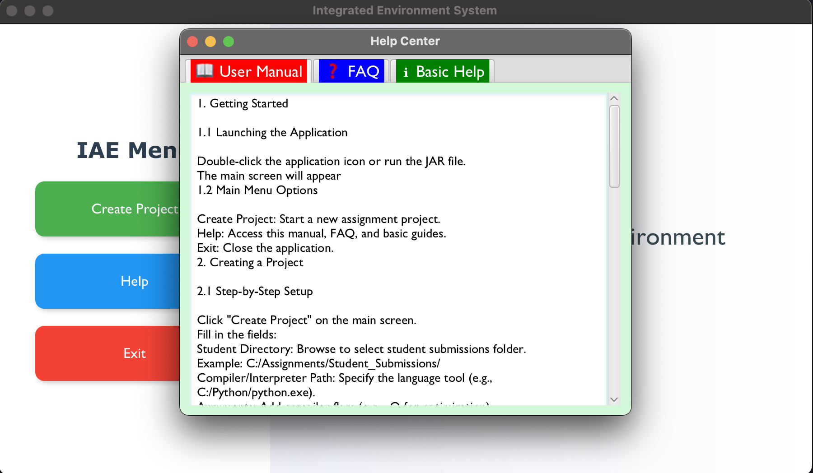

# Integrated Assignment Environment (IAE)

- This application developed for managing and evaluating programming assignments across different languages.

## Table of Contents
- [Features](#features)
- [Installation](#installation)
- [Usage](#usage)
- [Contributors](#contributors)

## Features
- 🛠️ Create and manage assignment configurations for multiple languages (C, Java, Python)
- 📦 Process student submissions in ZIP format automatically
- ⚙️ Custom compile/run workflows for different programming languages
- ✔️ Automated output comparison with expected results
- 📊 Comprehensive student result reporting
- 📂 Project saving and loading functionality
- 🔄 Configuration import/export for sharing
- 🆘 Integrated help manual

## Installation
1. **Using the Installer**:
   - Download `IAE-Setup.exe` from [Releases](https://github.com/yourusername/ce316-iae/releases)
   - Run the installer and follow the instructions
   - A desktop shortcut will be created automatically

## Usage

- Create Project: Start a new assignment.
- Help Center: Access documentation and FAQs.
- Exit: Close the application.

- Language Selection: Choose C, Python, etc.
- Student Directory: Path to ZIP submissions (e.g., C:/submissions/).
- Compiler/Interpreter: Configure tools (e.g., gcc for C).
- Arguments: Define test inputs (e.g., ./main "input1" "input2").
- Expected Output: Directory for correct answers.
- Run: Process all submissions automatically.

- User Manual:Detailed information about application.
- FAQ:You can save time with frequently asked questions part.
- Basic Help:Basic information about app.

## Contributors
- Meltem Demir
- Emiray Durmaz
- Betül Sinem Çetiner
- Yasemin Güler koçar
